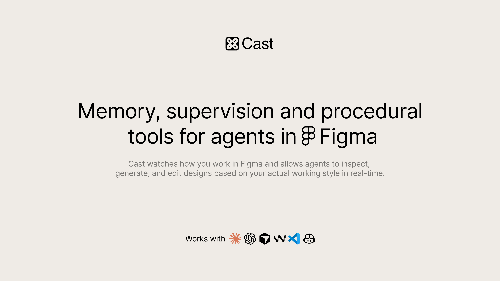

# Cast to Figma

Local CLI, bridge, and agent skill for controlling Figma through the [Cast Figma plugin](https://www.figma.com/community/plugin/1398410342518853126).

Cast lets AI agents inspect, generate, and edit designs using the context of your actual Figma file — including your edits, corrections, naming patterns, layout habits, and file-specific conventions.

## Install

### 1. Open the Figma plugin

Install and open the [Cast plugin](https://www.figma.com/community/plugin/1398410342518853126) in Figma Desktop.

### 2. Install the CLI & skill

```bash
npm install -g github:newfiction/cast-to-figma
cast-to-figma install-cli-skill --folder {agent_skill_folder}
```

`{agent_skill_folder}` stands for agent skills reference folder, e.g:

```bash
npm install -g github:newfiction/cast-to-figma
cast-to-figma install-cli-skill --folder ~/.claude/skills
```

## Usage

```bash
cast-to-figma status
cast-to-figma ping
cast-to-figma inspect --depth 3 --scale 1
cast-to-figma get-variables --query accent
cast-to-figma get-components --query button
cast-to-figma update-text --node-id 12:34 --text "Hello"
cast-to-figma watch
cast-to-figma watch --instruction="Apply the same correction to the remaining cards"
```

The CLI auto-starts a local bridge on `127.0.0.1:7777`. Override the port when needed:

```bash
CAST_BRIDGE_PORT=7778 cast-to-figma status
```

## Commands

- `status` — check bridge/plugin connection
- `ping` — return page/file metadata
- `inspect` — inspect node architecture and save a screenshot artifact
- `get-variables` — list local variables with lean summaries and optional drill-down filters
- `get-components` — list local components/component sets with lean summaries and optional drill-down filters
- `list-pages` — list open file pages
- `get-skill`, `update-skill` — read/write file-local agent skill markdown
- `get-memory`, `clear-memory` — read/clear file-local Cast memory
- `get-supervision`, `clear-supervision-backlog`, `clear-supervision` — manage supervision state
- `update-properties`, `resize-node`, `update-fills`, `update-text`, `set-layout` — edit existing nodes
- `create-node`, `move-node`, `delete-node`, `select-node` — manipulate nodes
- `list-user-tools`, `get-user-tools`, `get-user-tool` — inspect file-local procedural tools
- `add-user-tool`, `edit-user-tool`, `delete-user-tool`, `run-user-tool` — manage and execute file-local procedural tools
- `run-script` — execute scoped JavaScript in the Figma plugin context
- `undo` — undo the last Figma operation
- `watch` — watch designer change cycles and print required agent actions
- `install-cli-skill --folder {agent_skill_folder}` — install the bundled CLI skill into an agent skill folder
- `debug` — developer probe

### Help

```bash
cast-to-figma help
```

## Agent skill

![[scheme.png]]

*The installed skill instructs agents to*:
- inspect selected nodes and screenshots before visual edits
- read file-local skill, memory, user tools, and supervision context
- make small, verifiable design changes
- use wrapped Cast tools before raw scripts
- learn from designer corrections
- watch for designer change cycles after completing work

## Links

- Repo: https://github.com/newfiction/cast-to-figma
- Figma plugin: https://www.figma.com/community/plugin/1398410342518853126

## License

MIT
