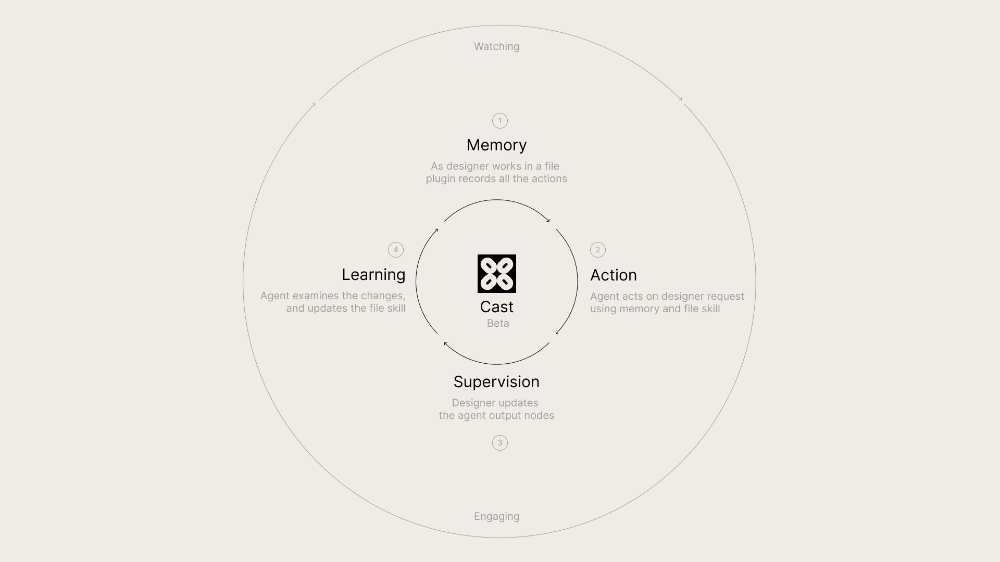

# Cast to Figma Agent Skill

Agent skill for using the [Cast to Figma CLI](https://github.com/newfiction/cast-to-figma-cli) from coding-agent harnesses.

This repo contains the skill instructions only. Install the CLI and Figma plugin separately.

## Requirements

1. **Figma plugin**  
   Install and open the Cast plugin in Figma Desktop:  
   https://www.figma.com/community/plugin/1398410342518853126

2. **CLI**  
   Install the Cast CLI:

   ```bash
   npm install -g @newfiction/cast-to-figma
   ```

   Try without global install:

   ```bash
   npx -y @newfiction/cast-to-figma status
   ```

   For regular agent work, global install is recommended because agents call the CLI repeatedly.

## Install the skill

Clone this repo into your agent skills directory:

```bash
git clone https://github.com/newfiction/cast-to-figma ~/.agents/skills/cast-to-figma
```

If your harness uses another skill directory, clone it there instead.

## Update the skill

```bash
cd ~/.agents/skills/cast-to-figma
git pull
```

## What the skill does

The skill instructs agents to use `cast-to-figma` for Figma work:

- inspect selected nodes and screenshots before visual edits
- read file-local skill, memory, user tools, and supervision context
- make small, verifiable design changes
- use wrapped Cast tools before raw scripts
- learn from designer corrections
- watch for designer change cycles after completing work

## Version metadata

The skill metadata is declared in `SKILL.md` frontmatter:

```yaml
version: 0.1.0
requiresCli: ">=0.1.0"
cliPackage: "@newfiction/cast-to-figma"
cliBinary: "cast-to-figma"
```

This lets future tooling check whether the installed skill, CLI, and Figma plugin are compatible.

## Links

- CLI repo: https://github.com/newfiction/cast-to-figma-cli
- npm package: https://www.npmjs.com/package/@newfiction/cast-to-figma
- Figma plugin: https://www.figma.com/community/plugin/1398410342518853126

## License

MIT
